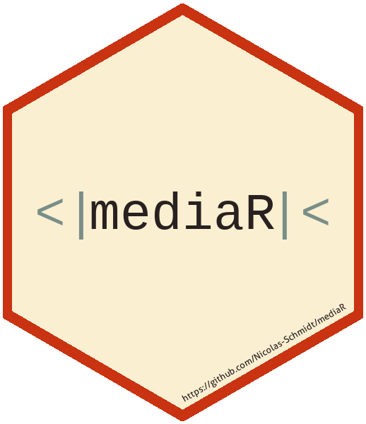

<!-- README.md is generated from README.Rmd. Please edit that file -->

# Programación en R para el análisis de datos </a>

Este es un curso que se dicta en la Facultad de Ciencias Sociales de la
Universidad de la República (Montevideo, Uruguay). En este
[link](https://github.com/Nicolas-Schmidt/mediaR/blob/master/man/Ejercicios/Programas_mediaR.pdf)
puede ver el programa. Este curso es una continuación del curso `IntRo`
que se puede consultar en este
[link](https://github.com/Nicolas-Schmidt/IntRo/). Este curso tambien
cuenta con un paquete para que los estudiantes puedan realizar los
ejercicios del mismo. El paquete se llama: `mediaR`. Es un curso
intermedio entre uno introductorio y uno avanzadao o experto.

Las **presentaciones** del curso están
[aquí](https://github.com/Nicolas-Schmidt/mediaR/tree/master/man/Presentaciones). 
Los **Ejercicios** del curso están
[aquí](https://github.com/Nicolas-Schmidt/mediaR/tree/master/man/Ejercicios). 
Los **conjuntos de datos** del curso están
[aquí](https://github.com/Nicolas-Schmidt/mediaR/tree/master/man/Datos). 
La pauta de la entrega final está
[aquí](https://github.com/Nicolas-Schmidt/mediaR/tree/master/man/Datos)

#### *_Docente_*

Nicolás Schmidt. Mail: <nschmidt@cienciassociales.edu.uy>
